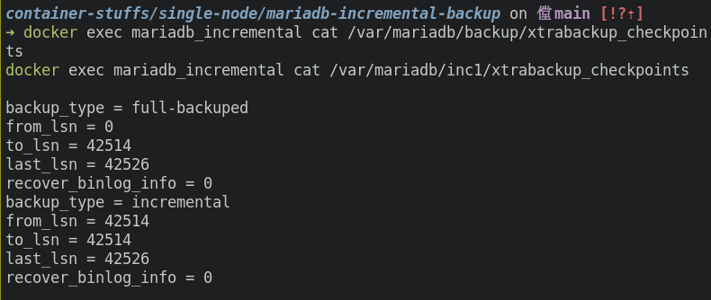
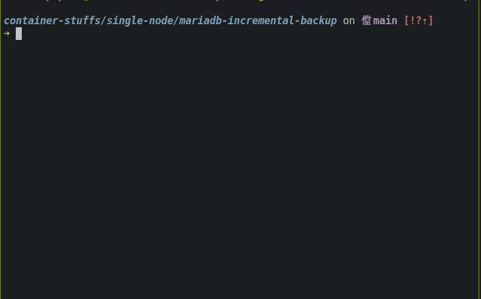

# MariaDB Incremental Backup

A simple Docker-based setup to learn how to perform **full and incremental backups** using `mariabackup`.  
This project demonstrates how to create a base backup and subsequent incremental backups, then verify their consistency all within a single Docker container.

## How to Run?

To run this project, make sure you're in the `container-stuffs` directory, then navigate to:

```sh
cd single-node/mariadb-incremental-backup
```

Copy the environment file. Update .env as needed (for example, change passwords or user credentials).

```sh
cp .env.example .env
```

Run the setup script.
This script will build and start the container, initialize the database, and then automatically perform:

1. A full backup, and
2. An incremental backup based on the previous checkpoint.

```sh
./incremental_backup.sh
```

```sh
bash incremental_backup.sh
```

You should see logs indicating both full and incremental backup processes have completed successfully:

```sh
[00] mariabackup: The latest check point (for incremental): 'xxxxx'
[00] Backup created in directory '/var/mariadb/inc1/'
[00] completed OK!
```

## Verify Incremental Backup

To verify the backup process inside the container, use the following commands:

List backup directories:

```sh
docker exec mariadb_incremental ls -l /var/mariadb/
```

Check checkpoint files for LSN (Log Sequence Number) consistency:

```sh
docker exec mariadb_incremental cat /var/mariadb/backup/xtrabackup_checkpoints
docker exec mariadb_incremental cat /var/mariadb/inc1/xtrabackup_checkpoints
```



> If the from_lsn of the incremental backup matches the to_lsn of the full backup - it means the incremental backup was created successfully.

## Test Restore

You can also test restoring the incremental backup by merging it into the full backup.

**Step 1 - Prepare full backup**:

```sh
docker exec mariadb_incremental sh -c "mariabackup --prepare --target-dir=/var/mariadb/backup/"
```

```sh
mariabackup based on MariaDB server 10.6.18-MariaDB debian-linux-gnu (x86_64)
[00] 2025-11-01 17:07:21 cd to /var/mariadb/backup/
[00] 2025-11-01 17:07:21 open files limit requested 0, set to 1048576
[00] 2025-11-01 17:07:21 This target seems to be not prepared yet.
[00] 2025-11-01 17:07:21 mariabackup: using the following InnoDB configuration for recovery:
[00] 2025-11-01 17:07:21 innodb_data_home_dir = .
[00] 2025-11-01 17:07:21 innodb_data_file_path = ibdata1:12M:autoextend
[00] 2025-11-01 17:07:21 innodb_log_group_home_dir = .
[00] 2025-11-01 17:07:21 InnoDB: Using Linux native AIO
...
...
...
[00] 2025-11-01 17:07:21 Starting InnoDB instance for recovery.
[00] 2025-11-01 17:07:21 mariabackup: Using 104857600 bytes for buffer pool (set by --use-memory parameter)
2025-11-01 17:07:21 0 [Note] InnoDB: Compressed tables use zlib 1.2.11
2025-11-01 17:07:21 0 [Note] InnoDB: Number of pools: 1
2025-11-01 17:07:21 0 [Note] InnoDB: Using crc32 + pclmulqdq instructions
2025-11-01 17:07:21 0 [Note] InnoDB: Using Linux native AIO
2025-11-01 17:07:21 0 [Note] InnoDB: Initializing buffer pool, total size = 104857600, chunk size = 104857600
2025-11-01 17:07:21 0 [Note] InnoDB: Completed initialization of buffer pool
2025-11-01 17:07:21 0 [Note] InnoDB: Starting crash recovery from checkpoint LSN=42514,42514
[00] 2025-11-01 17:07:21 Last binlog file , position 0
[00] 2025-11-01 17:07:21 completed OK!
```

**Step 2 - Apply incremental backup to base**:

```sh
mariabackup based on MariaDB server 10.6.18-MariaDB debian-linux-gnu (x86_64)
[00] 2025-11-01 17:09:52 incremental backup from 42514 is enabled.
[00] 2025-11-01 17:09:52 cd to /var/mariadb/backup/
[00] 2025-11-01 17:09:52 open files limit requested 0, set to 1048576
[00] 2025-11-01 17:09:52 This target seems to be already prepared.
[00] 2025-11-01 17:09:52 mariabackup: using the following InnoDB configuration for recovery:
[00] 2025-11-01 17:09:52 innodb_data_home_dir = .
[00] 2025-11-01 17:09:52 innodb_data_file_path = ibdata1:12M:autoextend
[00] 2025-11-01 17:09:52 innodb_log_group_home_dir = /var/mariadb/inc1/
[00] 2025-11-01 17:09:52 InnoDB: Using Linux native AIO
...
...
...
[01] 2025-11-01 17:09:52         ...done
[01] 2025-11-01 17:09:52 Copying /var/mariadb/inc1/example_db/db.opt to ./example_db/db.opt
[01] 2025-11-01 17:09:52         ...done
[01] 2025-11-01 17:09:52 Copying /var/mariadb/inc1/performance_schema/db.opt to ./performance_schema/db.opt
[01] 2025-11-01 17:09:52         ...done
[01] 2025-11-01 17:09:52 Copying /var/mariadb/inc1//aria_log_control to ./aria_log_control
[01] 2025-11-01 17:09:52         ...done
[01] 2025-11-01 17:09:52 Copying /var/mariadb/inc1//aria_log.00000001 to ./aria_log.00000001
[01] 2025-11-01 17:09:52         ...done
[00] 2025-11-01 17:09:52 Copying /var/mariadb/inc1//xtrabackup_binlog_info to ./xtrabackup_binlog_info
[00] 2025-11-01 17:09:52         ...done
[00] 2025-11-01 17:09:52 Copying /var/mariadb/inc1//xtrabackup_info to ./xtrabackup_info
[00] 2025-11-01 17:09:52         ...done
[00] 2025-11-01 17:09:52 completed OK!
```

Step 3 - (Optional) Repeat if there are many multiple incrementals

```sh
# Apply inc1
mariabackup --prepare --target-dir=/backup --incremental-dir=/inc1
# Apply inc2
mariabackup --prepare --target-dir=/backup --incremental-dir=/inc2
# Apply inc3
mariabackup --prepare --target-dir=/backup --incremental-dir=/inc3
```

## Tear Down

To stop and remove everything cleanly:

```sh
docker compose down -v
rm -rf backup/* inc1/*
```

## Demo


