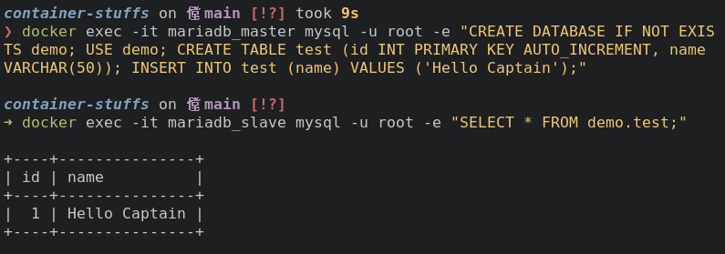
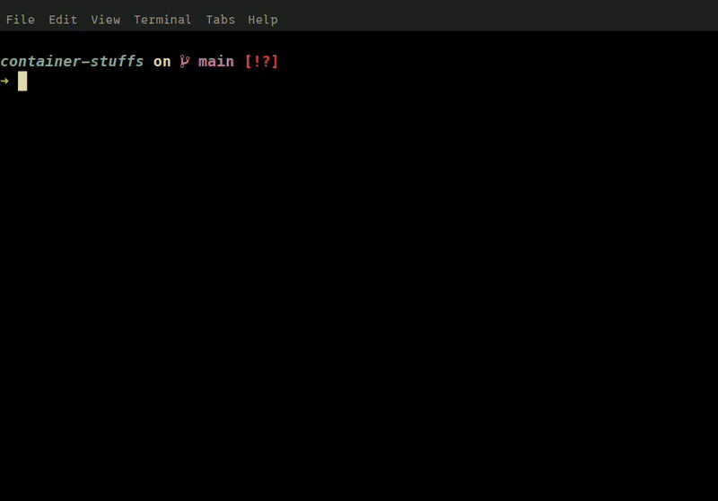

# MariaDB Master-Slave Replication

## How to Run?

To run this project just make sure you're in `container-stuffs` directory, then navigate to `single-node/mariadb-master-slave`.

```sh
cd single-node/mariadb-master-slave
```

Copy the environment file. Update `.env` as needed (for example, change passwords or user credentials).

```sh
cp .env.example .env
```

Run the setup script. This script will build and start the containers (master and slave), then initilize replication from master and next verify that replication is active.

```sh
./run.sh

or 

bash run.sh
```

To verify slave or replication status you can use `docker exec` command.

```sh
docker exec mariadb_slave sh -c "mysql -u root -e 'SHOW SLAVE STATUS\G'
```

You should see something like this:

```sh
Slave_IO_Running: Yes
Slave_SQL_Running: Yes
Seconds_Behind_Master: 0
```

## Test Replication

Try inserting data into the master database:

```sh
docker exec -it mariadb_master mysql -u root -e "CREATE DATABASE IF NOT EXISTS demo; USE demo; CREATE TABLE test (id INT PRIMARY KEY AUTO_INCREMENT, name VARCHAR(50)); INSERT INTO test (name) VALUES ('Hello Captain');"
```

Then check the slave:

```sh
docker exec -it mariadb_slave mysql -u root -e "SELECT * FROM demo.test;"
```



## Tear Down

To stop and remove everything cleanly:

```sh
docker compose down -v
rm -rf master/data/* slave/data/*
```

## Demo


