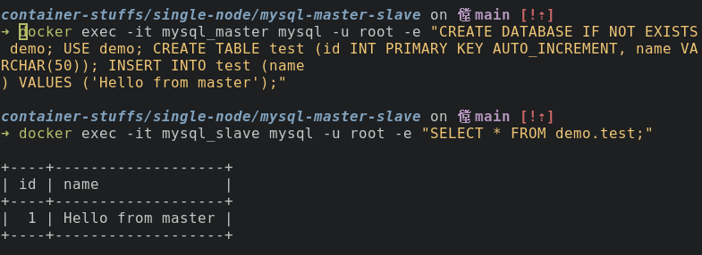
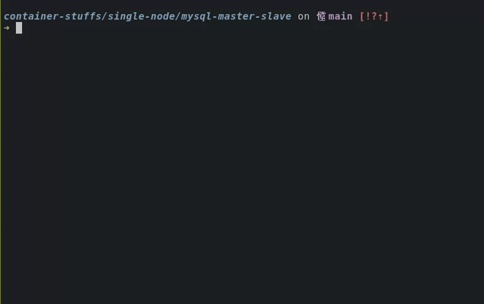

# MySQL Master Slave Using Docker

## How to Run?

To run this project just make sure you're in `container-stuffs` directory, then navigate to `single-node/mysql-master-slave`.

```bash
cd single-node/mysql-master-slave
```

Create new environment file.

```bash
cp .env.example .env
```

Change the values as you want. Example:

```sh
MYSQL_DATABASE=docker_db
MYSQL_USER=docker_user
MYSQL_PASSWORD=docker_pass
MYSQL_ALLOW_EMPTY_PASSWORD=1
```

Run the `.sh` file.

```bash
bash run.sh
```

or

```bash
./run.sh
```

Make sure the containers is up. Then accessing the master and slave.

```bash
docker exec -it mysql_master mysql -u docker_user -pdocker_pass
```

```bash
docker exec -it mysql_slave mysql -u docker_user -pdocker_pass
```

## Test Replication

Try to create new table, create new database or others modification to make sure the replication is running.

```sh
docker exec -it mysql_master mysql -u root -e "CREATE DATABASE IF NOT EXISTS demo; USE demo; CREATE TABLE test (id INT PRIMARY KEY AUTO_INCREMENT, name VARCHAR(50)); INSERT INTO test (name) VALUES ('Hello from master');"
```

Then check the slave:

```sh
docker exec -it mysql_slave mysql -u root -e "SELECT * FROM demo.test;"
```



## Tear Down

To stop and remove everything cleanly:

```sh
docker compose down -v
rm -rf master/data/* slave/data/*
```

## Demo

