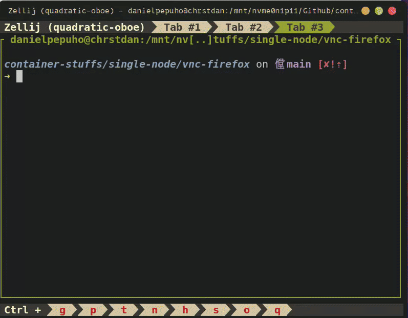

# VNC Firefox

## How to Run?

To run this project just make sure you're in `container-stuffs` directory, then navigate to `single-node/vnc-firefox`.

```bash
cd single-node/vnc-firefox
```

Build and start the container:

```bash
docker compose up --build -d
```

You’ll see logs as Supervisor starts each service:

```bash
docker logs -f vnc_firefox
```

```bash
2025-11-11 00:49:04,121 CRIT Supervisor is running as root.  Privileges were not dropped because no user is specified in the config file.  If you intend to run as root, you can set user=root in the config file to avoid this message.
2025-11-11 00:49:04,127 INFO supervisord started with pid 1
2025-11-11 00:49:05,134 INFO spawned: 'xvfb' with pid 7
2025-11-11 00:49:05,149 INFO spawned: 'x11vnc' with pid 8
2025-11-11 00:49:05,161 INFO spawned: 'fluxbox' with pid 9
2025-11-11 00:49:05,177 INFO spawned: 'firefox' with pid 10
2025-11-11 00:49:05,188 INFO spawned: 'novnc' with pid 11
2025-11-11 00:49:05,192 WARN exited: x11vnc (exit status 1; not expected)
2025-11-11 00:49:05,223 WARN exited: fluxbox (exit status 1; not expected)
2025-11-11 00:49:06,257 INFO success: xvfb entered RUNNING state, process has stayed up for > than 1 seconds (startsecs)
2025-11-11 00:49:06,262 INFO spawned: 'x11vnc' with pid 60
2025-11-11 00:49:06,272 INFO spawned: 'fluxbox' with pid 61
2025-11-11 00:49:06,279 INFO success: firefox entered RUNNING state, process has stayed up for > than 1 seconds (startsecs)
2025-11-11 00:49:06,279 INFO success: novnc entered RUNNING state, process has stayed up for > than 1 seconds (startsecs)
2025-11-11 00:49:07,763 INFO success: x11vnc entered RUNNING state, process has stayed up for > than 1 seconds (startsecs)
2025-11-11 00:49:07,764 INFO success: fluxbox entered RUNNING state, process has stayed up for > than 1 seconds (startsecs)
```

## Accessing Firefox

### Using a VNC Client

Open any VNC viewer (e.g., RealVNC, TigerVNC, Remmina), then connect to:

```bash
localhost:5901
```

Enter password:

```bash
dummypass
```

Or you can access the firefox browser using a Web Browser (noVNC). Just open your browser and visit:

```sh
http://localhost:6080/vnc.html
```

Input the same password then you’ll see the desktop environment and a running Firefox window.

## Tear Down

```sh
docker compose down -v
```

## Demo


